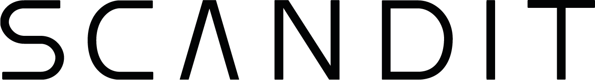

<p align="center">
  <a href="https://www.scandit.com/">
    
  </a>
</p>
<h3 align="center">Data Capture. Smarter.</h3>
<p align="center">Empower frontline workers and innovate customer experiences with Scandit Smart Data Capture. The flexible, modern way to capture barcodes, text, objects and IDs.</p>
<br />

## Documentation website

The main official Scandit documentation website is hosted at [docs.scandit.com](https://docs.scandit.com).

## Contribution requirements

The following are required if you are submitting pull requests to the documentation:

- NodeJS >=18.x.x
- NPM >= 6.x
- Yarn >= 1.22.x

## Issues

Submitting issues help to improve the documentation. If you find incorrect screenshot(s), instructions, or code examples, or if you discover UX/UI bugs on the website, please report them here.

## Requests

Requests for new documentation are highly encouraged. This is not limited to new additions but also changes or more information requested on existing documentation.

These requests will be checked by the Scandit Documentation team then transferred to another internal tool outside GitHub for prioritization and subsequent actions.

## Releases

Thanks to a continuous integration/continuous delivery workflow, the Scandit documentation can be updated up to several times a day.

## License

See the [LICENSE](./LICENSE) file for licensing information.

## Local Development

Install all dependencies:

```
$ yarn
```

Start the development server:

```
$ yarn start
```

This command starts a local development server and opens up a browser window. Most changes are reflected live without having to restart the server.


