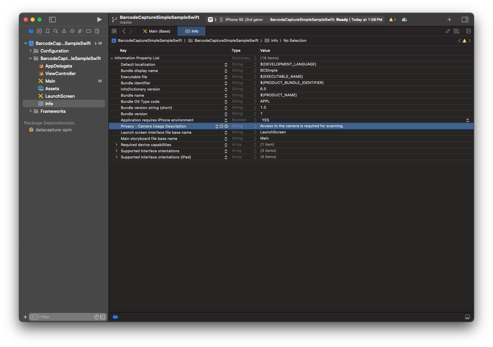

import Tabs from '@theme/Tabs';
import TabItem from '@theme/TabItem';

# Installation

This guide shows you how to add the Scandit Data Capture SDK to your existing project.

## Prerequisites

- The latest stable version of [React Native CLI and other related tools and dependencies](https://reactnative.dev/docs/environment-setup).
- A project with minimum iOS deployment target of 13.0 or higher. Or an Android project with target SDK version 23 (Android 6, Marshmallow) or higher.
- A valid Scandit Data Capture SDK license key. You can sign up for a free [test account](https://ssl.scandit.com/dashboard/sign-up?p=test&utm%5Fsource=documentation).

:::tip
Android devices running the Scandit Data Capture SDK need to have a GPU or the performance will drastically decrease.
:::

### Internal Dependencies

import InternalDependencies from '../../partials/_id-internal-deps.mdx';

<InternalDependencies/>

## Get a License Key

1. [Sign up](https://ssl.scandit.com/dashboard/sign-up?p=test) or [Sign in](https://ssl.scandit.com/dashboard/sign-in) to your Scandit account
2. Create a project
3. Create a license key

If you have a paid subscription, please reach out to [Scandit Support](mailto:support@scandit.com) if you need a new license key.

## Add the SDK

Currently we support adding the Scandit Data Capture SDK React Native plugins to your project in two ways. The simplest way is to use the npm registry, alternatively you can manually download the plugins and add them to your project.

:::tip
You should always make sure to add the scandit-react-native-datacapture-core plugin, as all other plugins depend on it.
:::

### Create a new project (optional)

If you do not have a React Native project yet that you’ll use, you should create a new one.

```sh
react-native init HelloScandit
cd HelloScandit
```

### Add the SDK from npm

To add our plugins from the npm registry, you can run these commands from your project’s root folder. In the following snippet we’re adding multiple plugins for different functionalities, but you can add only the ones you need.

```sh
yarn add scandit-react-native-datacapture-core
yarn add scandit-react-native-datacapture-barcode
yarn add scandit-react-native-datacapture-text
yarn add scandit-react-native-datacapture-parser
yarn add scandit-react-native-datacapture-id
```

:::tip
You can also specify a version `@<version>`.
:::

### Add the SDK manually

After you download the [archive](https://ssl.scandit.com/dashboard/downloads) containing all the plugins, unzip the archive. It includes the available React Native plugins, including the `scandit-react-native-datacapture-core` plugin that all other plugins depend on.

First add `scandit-react-native-datacapture-core` plugin:

```sh
yarn add <path to scandit-react-native-datacapture-core plugin>
```

Once this is done, you can continue with adding the plugin(s) for your desired functionality, e.g. for barcode capture add the `scandit-react-native-datacapture-barcode` plugin:

```sh
yarn add <path to scandit-react-native-datacapture-barcode plugin>
```

### Additional steps on iOS

After adding the plugins, you’ll want to make sure they’re added to your iOS project properly:

```sh
cd ios && pod install
```

## Additional Information

### Android Content Providers

On Android, the Scandit SDK uses content providers to initialize the scanning capabilities properly. If your own content providers depend on the Scandit SDK, choose an **initOrder** lower than 10 to make sure the SDK is ready first.

If not specified, **initOrder** is zero by default and you have nothing to worry about.

Check [the official `<provider>` documentation](https://developer.android.com/guide/topics/manifest/provider-element).

### Apple Privacy Settings

When using the Scandit Data Capture SDK you will want to set the camera as the frame source for various capture modes. You need to set the “Privacy - Camera Usage Description” field in the Info.plist file for iOS.



### Camera Permissions

When using the Scandit Data Capture SDK you will want to set the camera as the frame source for various capture modes. On Android, you have to request camera permissions in your own application before starting scanning. To see how you can achieve this, take a look at our [samples](./samples.md).

import OSSLicense from '../../partials/_third-party-licenses.mdx';

<OSSLicense/>
